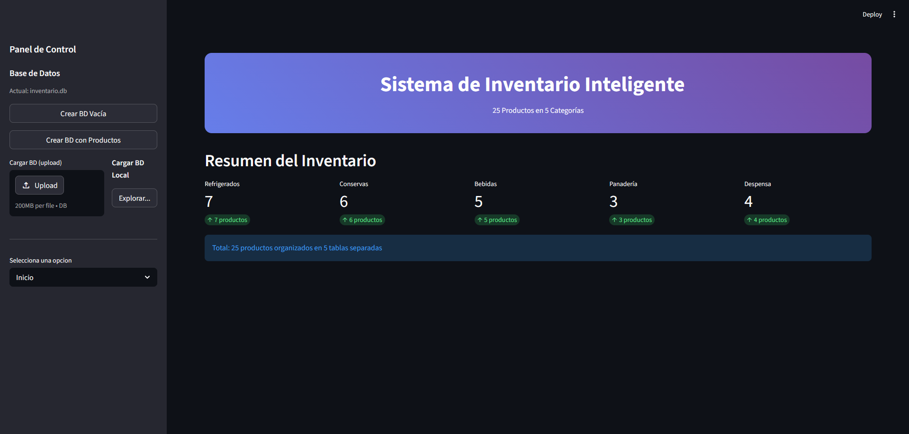
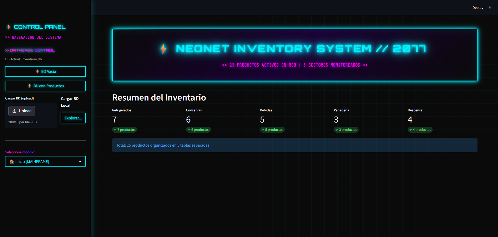

# Sistema de Markettalento Inventario Inteligente

[](https://github.com/zombiradiactivo/Markettalento-Inventario/actions)

Sistema de análisis de inventario que utiliza Visión Artificial (simulada) y Predicción de Demanda, refactorizado con arquitectura SRP y pipeline CI/CD.

## Características

- **Arquitectura SRP**: Código modularizado en `models/`, `services/` y `api/`
- **Base de datos**: SQLAlchemy con 25 productos en 5 categorías (Refrigerados, Conservas, Bebidas, Panadería, Despensa)
- **Visión Artificial**: Simulación de detección de productos con niveles de confianza
- **Predicción**: Estimación de demanda y días hasta agotamiento
- **Dashboards**: 2 interfaces Streamlit (estándar y cyberpunk)
- **CI/CD**: Pipeline con matriz de Python 3.9, 3.10, 3.11 y 3.12
- **Tests**: 42 tests modulares con pytest y pytest-mock

## Estructura del Proyecto

```
Markettalento Inventario/
├── streamlit_app.py                      # Dashboard Streamlit (estándar)
├── streamlit_app_cyberpunk.py           # Dashboard Streamlit (cyberpunk)
├── app.py                               # Aplicación Flask principal
├── config.py                             # Configuración
├── requirements.txt                      # Dependencias
├── models/                              # Capa de datos
│   ├── database.py                      # Configuración SQLAlchemy y modelos
│   ├── product_database.py              # Operaciones CRUD
│   ├── get_all_products.py             # Consulta de productos
│   ├── get_product_info.py              # Consulta individual
│   └── get_sales_history.py            # Historial de ventas
├── services/                            # Capa de lógica de negocio
│   ├── vision/vision.py                # Servicio de visión artificial
│   ├── prediction/prediction.py        # Servicio de predicción
│   └── inventory/                      # Servicios de inventario
│       ├── metrics.py                   # Métricas
│       ├── recommendations.py           # Recomendaciones
│       └── value.py                     # Valor monetario
├── api/routes.py                        # Endpoints Flask
├── tests/                               # Tests modulares
│   ├── vision/
│   ├── prediction/
│   ├── inventory/
│   └── integration/
├── docs/                                # Documentación
│   ├── arquitectura.md                 # Documentación de arquitectura SRP
│   ├── Final.md                         # Memoria final del proyecto
│   └── Codigo_Heredado/                # Análisis del código original
└── .github/workflows/ci.yml            # Pipeline CI/CD
```

## Instalación

```bash
# Clonar el repositorio
git clone https://github.com/zombiradiactivo/Markettalento-Inventario.git
cd Markettalento-Inventario

# Crear entorno virtual (opcional pero recomendado)
python -m venv .venv
source .venv/bin/activate  # En Windows: .venv\Scripts\activate

# Instalar dependencias
pip install -r requirements.txt
```

## Ejecución

### Dashboard Streamlit (Recomendado)

```bash
# Versión estándar
streamlit run streamlit_app.py

# Versión cyberpunk
streamlit run streamlit_app_cyberpunk.py
```

### API Flask

```bash
python app.py
```

La API estará disponible en `http://localhost:5005`

## Endpoints Disponibles

| Método | Endpoint | Descripción |
|--------|----------|-------------|
| GET | / | Dashboard principal |
| GET | /endpoint | Dashboard de endpoints |
| GET | /api/test | Prueba de conexión |
| GET | /api/analizar-inventario | Análisis completo de inventario |
| GET | /api/productos | Catálogo de productos |
| GET | /api/producto/<nombre> | Detalle de producto |
| GET | /api/recomendaciones | Recomendaciones de stock |

## Uso de Inteligencia Artificial

Este proyecto utiliza IA como **copiloto** siguiendo el enfoque de "IA as copilot, not pilot":

- **Commits etiquetados**: Todo commit donde participó la IA lleva la etiqueta `[ai]`
- **Herramienta utilizada**: OpenCode (opencode/hy3-preview-free)
- **Transparencia**: El desarrollador puede explicar verbalmente todo el código del repositorio
- **Criterio humano**: La IA propone, el desarrollador evalúa, prueba y ajusta

### Inventario de Uso de IA

| Tarea | % IA | % Manual |
|------|------|---------|
| Refactorización de servicios | 70% | 30% |
| Tests unitarios | 80% | 20% |
| Documentación | 90% | 10% |
| CI/CD | 85% | 15% |

## Capturas de Pantalla

### Dashboard Streamlit (Estándar)



### Dashboard Streamlit (Cyberpunk)


### Pipeline CI/CD (GitHub Actions)
*Captura pendiente de añadir*

## Ejecución de Tests

```bash
# Ejecutar todos los tests
pytest tests/ -v

# Ejecutar con cobertura
pytest tests/ --cov=models --cov=services --cov-report=html

# Ejecutar un test específico
pytest tests/test_streamlit_app.py -v
```

## Principios de Diseño

Este proyecto sigue el principio **SRP (Single Responsibility Principle)**:

- **models/**: Gestión de datos y acceso a base de datos (SQLAlchemy)
- **services/**: Lógica de negocio separada por dominio (vision, prediction, inventory)
- **api/**: Capa de presentación y rutas HTTP Flask
- **templates/**: Interfaz de usuario separada del código Python

## Documentación

- [Arquitectura SRP](docs/arquitectura.md) - Documentación de módulos y responsabilidades
- [Memoria Final](docs/Final.md) - Análisis completo, tabla de módulos e inventario de IA
- [Código Heredado - Análisis](docs/Codigo_Heredado/analisis_problemas.md) - Problemas del código original

## Tecnologías Utilizadas

- **Python 3.9+** (probado en 3.9, 3.10, 3.11, 3.12)
- **Flask** - API REST
- **SQLAlchemy 2.0** - ORM para base de datos
- **Streamlit 1.45+** - Dashboards interactivos
- **pytest** - Framework de testing
- **GitHub Actions** - CI/CD pipeline

## Estado del Proyecto

- ✅ Código refactorizado con SRP
- ✅ 42 tests pasando
- ✅ Pipeline CI/CD en verde (4 versiones Python)
- ✅ Documentación técnica completa
- ✅ 16 commits semánticos (varios etiquetados [ai])
- ✅ Dashboards Streamlit funcionales

## Licencia

MIT License - Ver [LICENSE](LICENSE)
